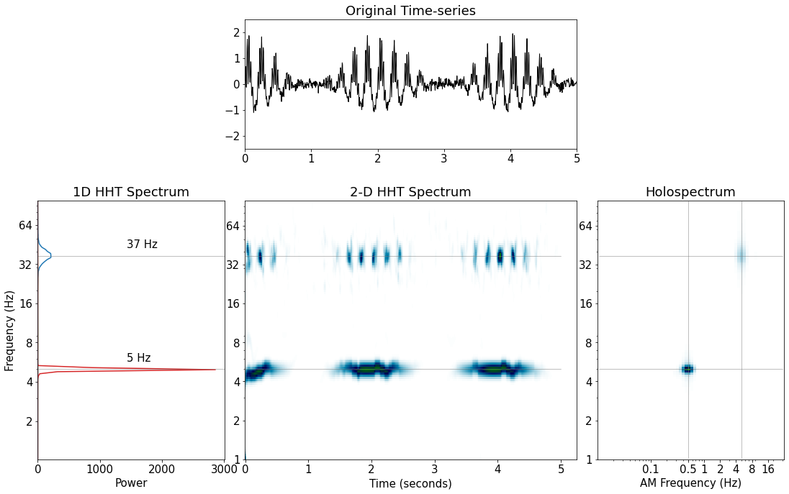

# Summary

The Empirical Mode Decomposition ([EMD](https://emd.readthedocs.io/en/latest/))
package contains Python (>=3.5) functions for analysis of non-linear and
non-stationary oscillatory time series. `EMD` implements a family of sifting
algorithms, instantaneous frequency transformations, power spectrum
construction and single-cycle feature extraction. Many natural signals contain
non-linear or non-sinusoidal features that change dynamically over time. These
complex and dynamic features are often of analytic interest but can be
challenging to isolate and quantify. The Empirical Mode Decomposition offers a
potential solution defined by the sift-algorithm; a data-adaptive decomposition
that separates a signal into a set of physically interpretable Intrinsic Mode
Functions (IMFs) that permit well behaved Hilbert transforms [@Huang1998].
Crucially, the decomposition works on local segments of the data and is
therefore able to efficiently isolate and describe non-linear and
non-stationary signal features.

# Package Features

The sift algorithm is implemented in the `emd.sift` module, including the
classic sift (`emd.sift.sift`; @Huang1998), the Ensemble EMD
(`emd.sift.ensemble_sift`; @Wu2009), Masked EMD (`emd.sift.mask_sift`;
@Deering2005) and the second-level sift (`emd.sift.sift_second_layer`;
@Huang2016). An example set of Instrinsic Mode Functions isolated by a
Masked-Sift is shown in Figure 1. The sift functions rest upon a range of
lower-level utility functions which can be customised and used directly if
needed. All levels of the sift computation are customisable from the top-level
sift functions. Users can configure these sift options using a dictionary-like
`emd.sift.SiftConfig` object. This config can then be passed directly to the
sift functions or saved in `YAML` format for later use or sharing.

Each IMF can be analysed in terms of its instantaneous frequency
characteristics at the full temporal resolution of the dataset [@Huang2009].
The Hilbert-transform is used to construct an energy-frequency or
energy-frequency-time spectrum known as the Hilbert-Huang Transform (HHT). A
second level decomposition of the amplitude modulations of each IMF extends the
HHT to the Holospectrum describing signal energy across carrier frequency,
amplitude modulation frequency and time [@Huang2016]. The frequency transforms are
implemented in the `emd.spectra` submodule. `emd.spectra.frequency_stats`
implements a set of methods for computing instantaneous frequency, phase and
amplitude from a set of IMFs. These can be used as inputs to the
`emd.spectra.hilberthuang` or `emd.spectra.holospectrum` to energy
distributions across time and frequency (see examples in Figures 3 and 4). The
Hilbert-Huang and Holospectrum computations can be very large so these
functions use an efficient sparse array implementation.

The `EMD` toolbox provides a range of functions for the detection of oscillatory
cycles from the IMFs of a signal. Once identified, each cycle can be
characterised by a range of features including its amplitude, frequency and
waveform shape. Tools are provided for detecting continuous chains of
oscillatory cycles and for matching similar cycles across datasets. The cycle
analysis functions are implemented in `emd.cycle`.

A range of utility and support features are included in the `EMD` toolbox.
Firstly, a customisable logger (implemented in `emd.logger`) is threaded
throughout the toolbox to provide progress output about ongoing computations,
warnings and errors. The logger output may be augmented by the user and any
output can be directed to a specified log file in addition to the console.
Secondly, `EMD` is supported by a range of tests implemented in the `py.test`
framework. These include both routine usage tests and tests ensuring that the
behaviour of the sift routines meet a set of pre-specified requirements.
Finally, `emd.support` contains a set of functions for running tests and
checking which versions of `EMD` are currently installed and whether updates
are available on [PyPI](https://pypi.org/project/emd/).

# Target Audience

Since its initial publication in 1998, the EMD approach has had a wide impact
across science and engineering, finding applications in turbulance, fluid
dynamics, geology, biophysics and neuroscience amongst many others. The `EMD`
toolbox will be of interest to scientists, engineers and applied mathematicians
looking to characterise signals with rich dynamics with a high temporal and
spectral resolution.

# State of the field

The popularity of the EMD algorithm has lead to several existing
implementations. Here, we include an incomplete list of these toolboxes. In
Python, there are two substantial EMD implementations available on the PyPI
server. [PyEMD](https://pyemd.readthedocs.io/en/latest/) and
[PyHHT](https://pyhht.readthedocs.io/en/latest/). Each of these packages
implements a family of sifting routines and frequency transforms. Another
implementation of EMD in Matlab and C is available from [Patrick
Flandarin](http://perso.ens-lyon.fr/patrick.flandrin/emd.html). This provides a
wide range of sift functions but limited frequency transform or spectrum
computations. Finally, the basic EMD algorithm and HHT is implemented in
versions of the [MatLab signal processing
toolbox](https://uk.mathworks.com/help/signal/ref/emd.html)

# Installation & Contribution

The EMD package is implemented in Python (>=3.5). freely available under a
GPL-3 license from PyPI.org using ```pip install emd```. Users and developers
can also install from source from [gitlab](https://gitlab.com/emd-dev/emd). Our
[documenatation](https://emd.readthedocs.io) provides detailed instructions on
[installation](https://emd.readthedocs.io/en/latest/install.html) and a range
of practical
[tutorials](https://emd.readthedocs.io/en/latest/emd_tutorials/index.html).
Finally, users wishing to submit bug reports or merge-requests are able to do
so on our gitlab page following our [contribution
guidelines](https://emd.readthedocs.io/en/latest/contributing.html).




\pagebreak

# Acknowledgements

We would like to thank Norden Huang, Chi-Hung Juan, Jia-Rong Yeh and Wei-Kuang
Liang for enjoyable and fruitful discussions on EMD theory and applications in
recent years. We would also like to thank Jasper Hajonides van der Meulen and
Irene Echeverria-Altuna for their time, patience and feedback on early versions
of this toolbox.

# References
