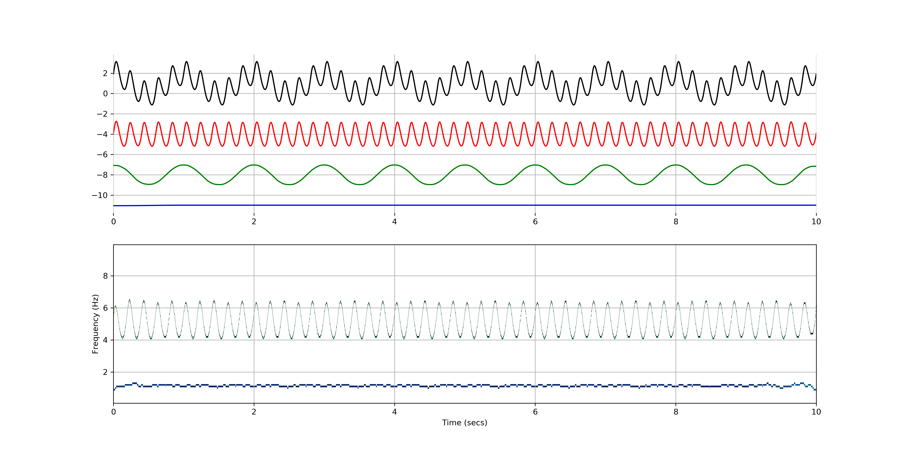

Tutorial 1 - Analysing a synthetic signal
=========================================

This getting started tutorial shows how to use EMD to analyse a synthetic
signal.

First of all, we import both the numpy and EMD modules:

.. code-block:: python

  import numpy as np
  import emd

We then define a simulated waveform containing a non-linear wave at 5Hz and a
sinusoid at 1Hz:

.. code-block:: python

   sample_rate = 1000
   seconds = 10
   num_samples = sample_rate*seconds

   time_vect = np.linspace(0, seconds, num_samples)

   freq = 5

   # Change extent of deformation from sinusoidal shape [-1 to 1]
   nonlinearity_deg = .25

   # Change left-right skew of deformation [-pi to pi]
   nonlinearity_phi = -np.pi/4

   # Compute the signal
   x = emd.utils.abreu2010( freq, nonlinearity_deg, nonlinearity_phi, sample_rate, seconds )
   x += np.cos( 2*np.pi*1*time_vect )

We can then estimate the IMFs for the signal:

.. code-block:: python

   imf = emd.sift.sift(x)

and, from the IMFs, compute the instantaneous frequency, phase and amplitude
using the Normalised Hilbert Transform Method:

.. code-block:: python

    IP, IF, IA = emd.spectra.frequency_stats(imf, sample_rate, 'nht')

From the instantaneous frequency and amplitude, we can compute the
Hilbert-Huang spectrum:

.. code-block:: python

   freq_edges,freq_bins = emd.spectra.define_hist_bins(0, 10, 100)
   hht = emd.spectra.hilberthuang(IF, IA, freq_edges)

And from these computations, we can plot some summary information:

.. code-block:: python

   import matplotlib.pyplot as plt

   plt.figure(figsize=(16, 8))

   plt.subplot(2, 1, 1, frameon=False)
   plt.plot(time_vect, x, 'k')
   plt.plot(time_vect, imf[:,0]-4, 'r')
   plt.plot(time_vect, imf[:,1]-8, 'g')
   plt.plot(time_vect, imf[:,2]-12, 'b')
   plt.xlim(time_vect[0], time_vect[-1])
   plt.grid(True)

   plt.subplot(2, 1, 2)
   plt.pcolormesh(time_vect, freq_bins, hht, cmap='ocean_r')
   plt.ylabel('Frequency (Hz)')
   plt.xlabel('Time (secs)')

   plt.grid(True)
   plt.show()

